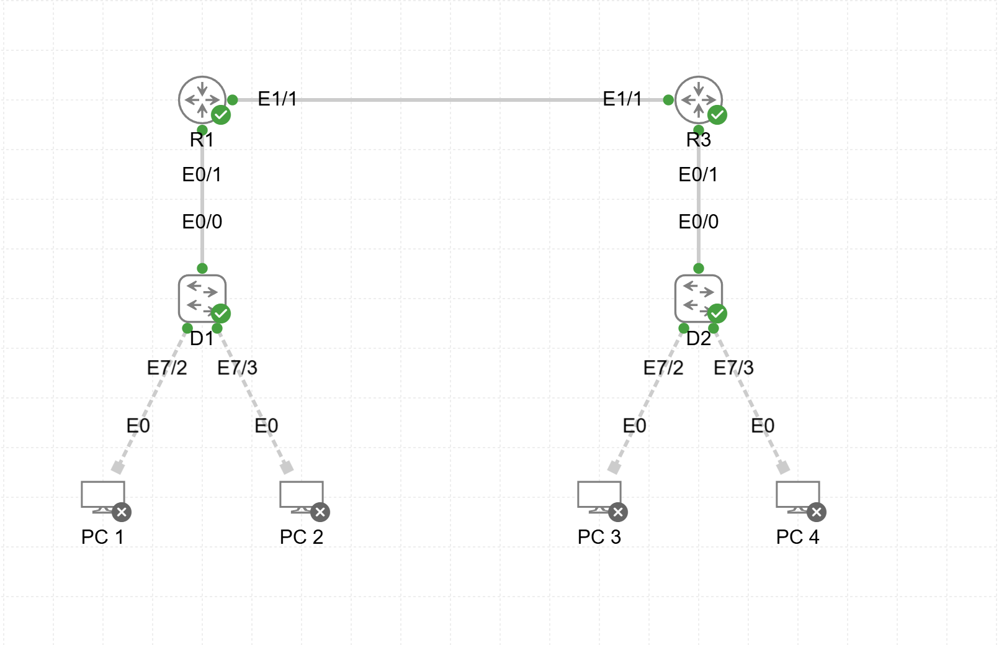

# Lab01 — Inter-VLAN Routing

**Goal:**  
Configure inter-VLAN routing between two switches and verify VLAN-to-VLAN connectivity.

**Devices:**  
- D1, D2 — L3 Switches  
- R1, R3 — Routers  

**Topology:**  

**Files:**  
- `Inter VLAN routing.yaml` — CML topology  
- `D1_config.txt`  
- `D2_config.txt`  
- `R1_config.txt`  
- `R3_config.txt`

**Verification:**  
- VLAN-to-VLAN reachability  
- Trunk configuration  
- Interface status and addressing  
- Routing table validation