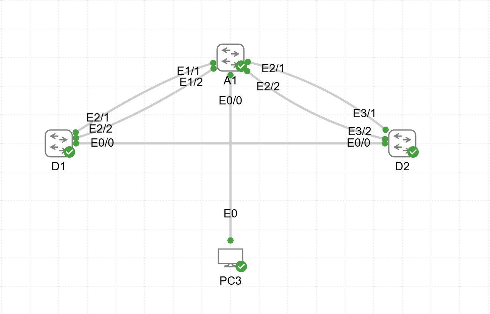

# Lab03 — Multiple Spanning Tree (MST)

**Goal:**  
Configure and verify Multiple Spanning Tree (MST) operation with multiple instances and VLAN mapping.

**Devices:**  
- D1, D2 — L3 Switches  
- A1 — L2 Switch  

**Topology:**  

**Files:**  
- `MST.yaml` — CML topology  
- `D1_config.txt`  
- `D2_config.txt`  
- `A1_config.txt`  

**Verification:**  
- MST instance configuration  
- Root bridge election per instance  
- VLAN-to-instance mapping  
- Port role and cost per MST instance
