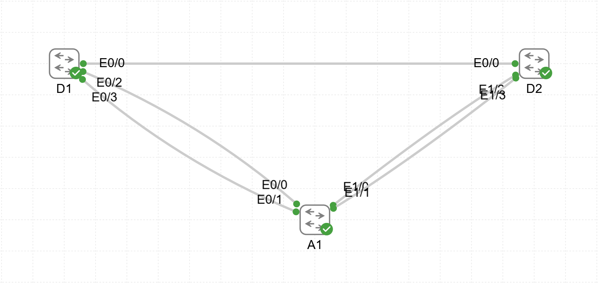

# Lab04 — VTP Implementation

**Goal:**  
Configure and verify VLAN Trunking Protocol (VTP) operation across multiple switches.

**Devices:**  
- D1, D2 — L3 Switches  
- A1 — L2 Switch  

**Topology:**  

**Files:**  
- `VTP.yaml` — CML topology  
- `D1_config.txt`  
- `D2_config.txt`  
- `A1_config.txt`

**Verification:**  
- VTP domain and mode configuration  
- VLAN propagation between switches  
- Trunk status  
- Synchronization and revision number
