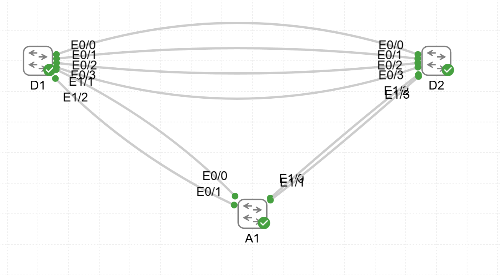

# Lab05 — EtherChannel Configuration

**Goal:**  
Implement and verify Layer 2 EtherChannel using LACP and PAgP modes between switches.

**Devices:**  
- D1, D2 — L3 Switches  
- A1 — L2 Switch  

**Topology:**  

**Files:**  
- `EtherChannel.yaml` — CML topology  
- `D1_config.txt`  
- `D2_config.txt`  
- `A1_config.txt`

**Verification:**  
- EtherChannel formation using LACP and PAgP  
- Port-channel status and mode  
- Load-balancing and redundancy behavior
