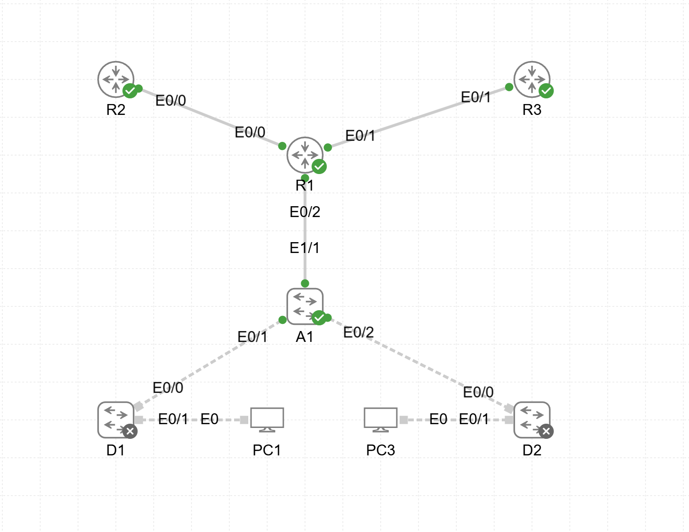

# Lab06 — VRF-Lite

**Goal:**  
Implement and verify VRF-Lite for IPv4 and IPv6 separation between customers.

**Devices:**  
- R1, R2, R3 — Routers  
- D1, D2 — L3 Switches  
- A1 — L2 Switch  

**Topology:**  

**Files:**  
- `VRF_LITE.yaml` — CML topology  
- `R1_config.txt`  
- `R2_config.txt`  
- `R3_config.txt`  
- `D1_config.txt`  
- `D2_config.txt`  
- `A1_config.txt`

**Verification:**  
- VRF definition and assignment  
- Interface VRF mapping  
- IPv4 and IPv6 routing separation  
- Connectivity between VRF instances
