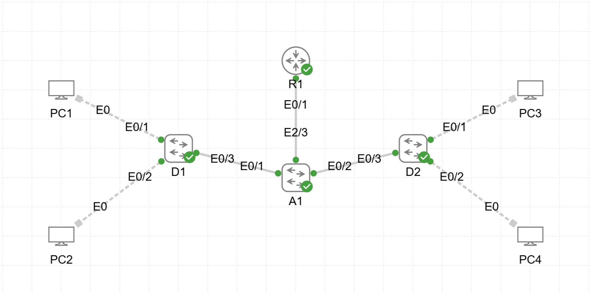

# Lab07 — OSPFv2 Configuration

**Goal:**  
Configure and verify OSPFv2 routing across multiple routers and switches.

**Devices:**  
- R1 — OSPF ABR, default route originator  
- D1, D2 — L3 Switches participating in OSPF  
- A1 — L2 Switch  

**Topology:**  

**Files:**  
- `OSPFv2.yaml` — CML topology  
- `R1_config.txt`  
- `D1_config.txt`  
- `D2_config.txt`  
- `A1_config.txt`

**Verification:**  
- OSPF neighbor adjacency and states  
- Router ID and interface participation  
- Route propagation and default route advertisement  
- Loopback reachability via OSPF
