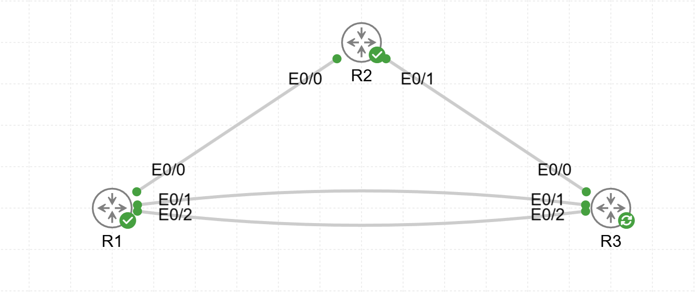

# Lab11 — MP-BGP IPv4 and IPv6

**Goal:**  
Configure and verify Multiprotocol BGP (MP-BGP) for IPv4 and IPv6 routing between autonomous systems.

**Devices:**  
- R1, R2, R3 — Routers  

**Topology:**  

**Files:**  
- `MP-BGP.yaml` — CML topology  
- `R1_config.txt`  
- `R2_config.txt`  
- `R3_config.txt`

**Verification:**  
- iBGP and eBGP session establishment  
- IPv4 and IPv6 route exchange  
- Aggregation and advertisement policies  
- Route reachability between AS 1000, 500, and 300
