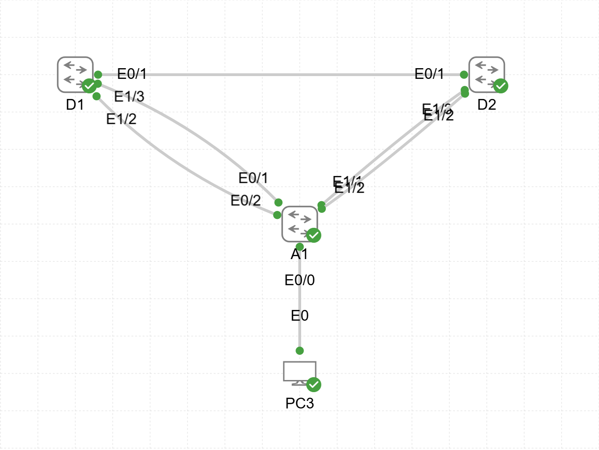

# Lab13 — STP Modifications and Protection

**Goal:**  
Configure and verify Spanning Tree Protocol (STP) enhancements and protection mechanisms.

**Devices:**  
- A1 — L2 Switch  
- D1, D2 — L3 Switches  

**Topology:**  

**Files:**  
- `STP_Modifications_and_Mechanisms.yaml` — CML topology  
- `A1_config.txt`  
- `D1_config.txt`  
- `D2_config.txt`

**Verification:**  
- Root bridge election and priority configuration  
- PortFast, BPDU Guard, and loop protection  
- Path cost and port priority tuning  
- `show spanning-tree` and `show interfaces trunk` checks
