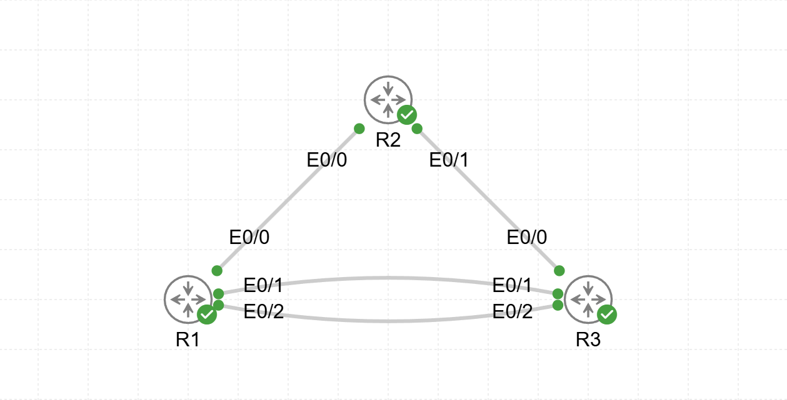

# Lab14 — Static IPv4 and IPv6 Routing

**Goal:**  
Configure and verify static IPv4 and IPv6 routes between routers.

**Devices:**  
- R1, R2, R3 — Routers  

**Topology:**  

**Files:**  
- `Static_IPv4_IPv6_routing.yaml` — CML topology  
- `R1_config.txt`  
- `R2_config.txt`  
- `R3_config.txt`

**Verification:**  
- IPv4 and IPv6 static route configuration  
- Primary and floating static routes  
- Link-local next-hop verification for IPv6  
- End-to-end connectivity between all loopback networks
